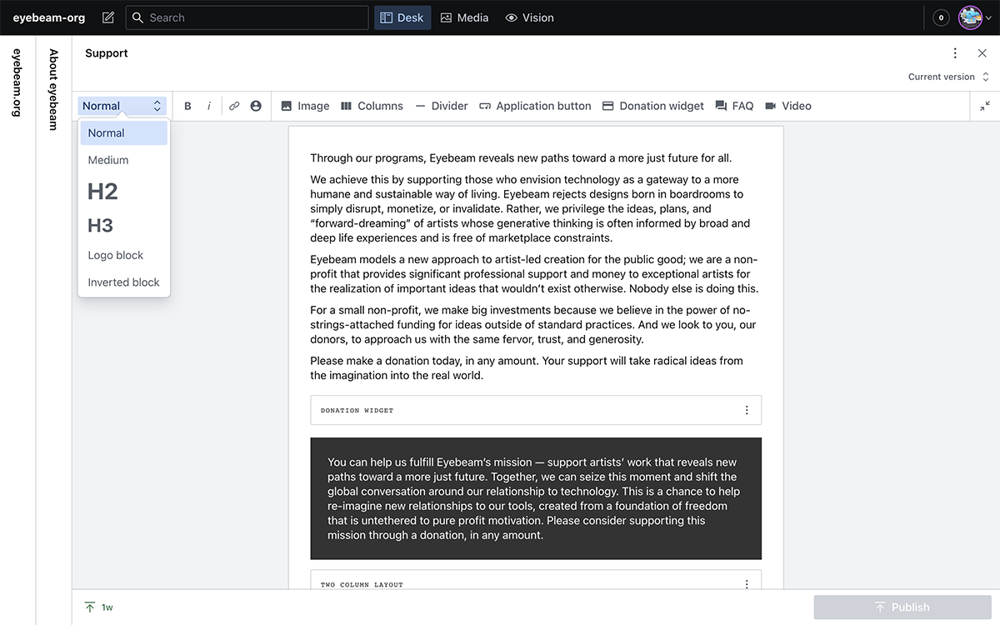

# eyebeam.org – CMS documentation

## Overview

The Eyebeam website is using the sanity content management system. It is located at https://eyebeam-org.sanity.studio/

General notes:

- All images have a field to set an alt text. Remember to do this!
- Images are automatically re-sized and converted to grayscale. Upload as high resolution versions as you have, in jpg or png format.

## The Content Editor

Most content editing and entry takes place in the content editor window. Most pages have a field of this type.

General notes:

- Pressing `ENTER` will create a new paragraph resulting in a bigger vertical space. To make a single line break without creating a new paragraph press `OPTION + ENTER`.

### Text styles dropdown

Select a paragraph of text and change the style here. Note that text marked as **H2** will create a internal link shown in the sidebar of the page.

There are two special styles:  **Logo block** is shown in the frontend with borders top and bottom and the beam logo on top. **Inverted block** is shown with padding and inverted in color.

### Person link

Creates a link to a post of the type 'Person' type. Shown with a pop-up preview box in the frontend.

### Add Image

Settings allow you to align the image left or right as well as have to take up the full width of the article area.

### Add Video

Embeds a post of the 'Video' type.

## Notes about specific pages

### General: Stickers

Special announcements showing up on the front page. Can be either text or image. There are two slots: 

**Right:** Taking the place of the Open Eyebeam square

**Left:** Taking the place of the "Eyebeam is changing" square – or both the "Eyebeam is changing" and "Support Eyebeam" squares if the `Full width` toggle is set.

### General: Ambient Images

Images added here will be used randomly for pages that do not have a main image explicitly set.

### General: Cities

Here you can set the cities where the current fellows live. These will be shown in the slide-down header. 

Note that you need to enter the timezone for each city in this format: https://en.wikipedia.org/wiki/List_of_tz_database_time_zones

### General: Statements

The quotes shown in the sidebar. 
